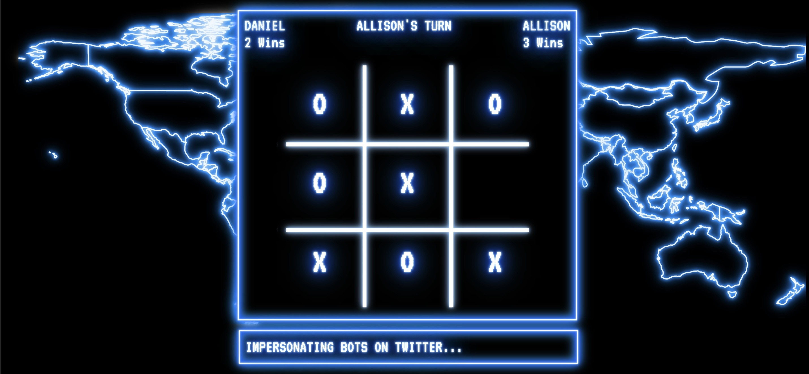

# TIC-TAC-TOE

### Abstract:
A webpage that you can use to play tic-tac-toe with another person (or by yourself... I feel you).  It's styled a little after 1983's WarGames for fun.  The game keeps track of each player's name and game wins. I added a 'loading screen' to give it some more character and as a way of inputing player names.  It has a basic data model and renders the DOM based exclusively on the data model as the game is played. I also added a comment section with an array of comments that are randomly displayed.  The JavaScript, HTML and CSS were all written from scratch. No external libraries or frameworks were used, just basic JaveScript, HTML and CSS :)

### Deployed Site
[GitHub Pages](https://nordbyi.github.io/Tic-Tac-Toe/)

### Installation Instructions:
1. Fork this project to your own Github account
2. Clone the repository to your local machine
3. `cd` into the project
4. On your terminal, `open index.html`

### Preview of the Game:

### Context:
This is the final project for mod 1 at Turing School of Software & Design's Front End Engineering Program. I had 8 days to complete the project.  It took me about 20 hours (with a lot of that time re-learning photoshop and making the loading page for fun).

### Creator
Ian Nordby [linkedIn](https://www.linkedin.com/in/iannordby/), [Github](https://github.com/nordbyi)

### Learning Goals:
Demonstrate understanding of DRY JavaScript and event delegation.  Implement a data model and update the DOM based only on the data model.  Iterate through DOM elements using for loops (I used array iterator methods to practive upcoming materials) and use problem solving skills to break down a large project and create its components.

### Wins:
I enjoyed learning about and incorporation custom HTML elements, custom CSS properties and creating a function to mimic typewriting in the DOM.  I particularly enjoyed making the typewriting function keep calling itself after a setTimeout, until the text was fully displayed.
